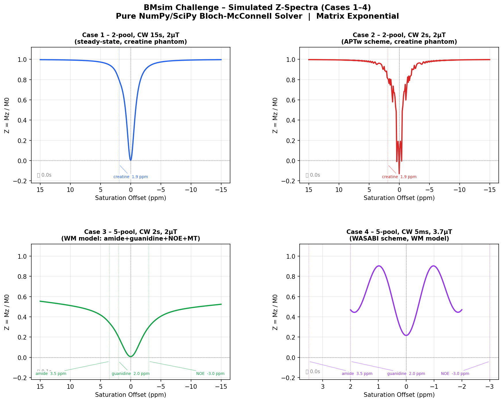
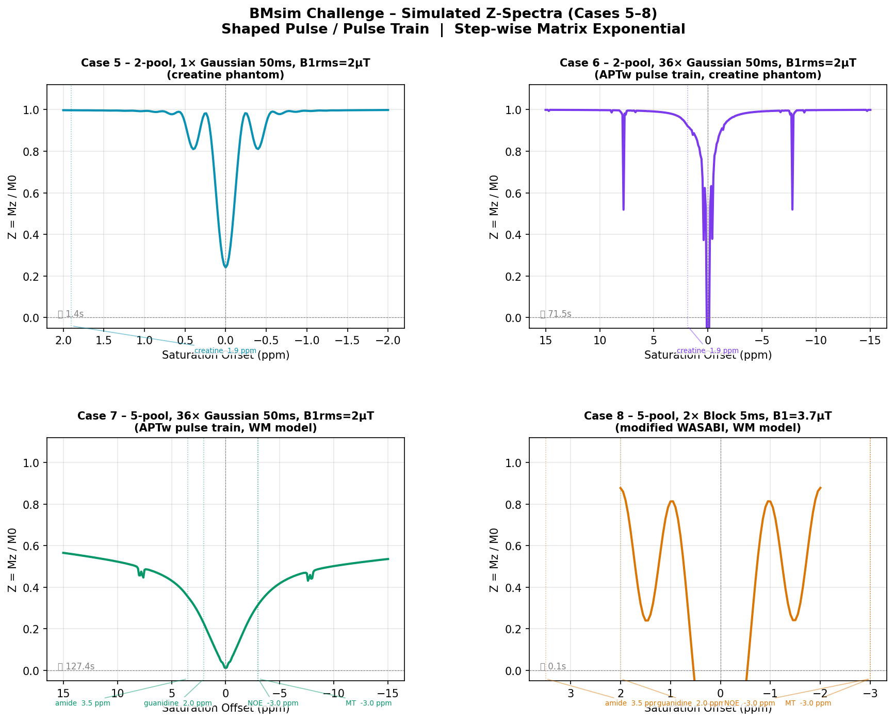

# Bloch-McConnell Simulation — BMsim Challenge

Pure Python implementation of Bloch-McConnell (BM) equations for the
[BMsim Challenge](https://github.com/pulseq-cest/BMsim_challenge) —
a community validation study of CEST MRI simulation tools organised by
Moritz Zaiss, Patrick Schuenke, and Markus Zimmermann.

---

## What this is

The BMsim Challenge asks research groups worldwide to simulate 8 well-defined
CEST MRI scenarios and compare results against each other. This repository
contains a fully spec-compliant Python solver that:

- Implements the full multi-pool Bloch-McConnell equations from scratch (NumPy / SciPy)
- Uses **matrix-exponential integration** (`scipy.linalg.expm`, Padé order 13)
- Handles CW block pulses (cases 1–4) and Gaussian shaped pulses / pulse trains (cases 5–8)
- Passes every compliance check in the [challenge FAQ](https://github.com/pulseq-cest/BMsim_challenge#faq)
- Outputs raw Mz values in the exact format used by all other participating groups

---

## Simulation tool details

| Property | Value |
|---|---|
| Language | Python 3.12 (NumPy, SciPy, PyYAML) |
| Number of pools | Dynamic — 2-pool or 5-pool per case, read from YAML |
| MT components | x, y, z — full 3-component treatment |
| MT lineshape | Lorentzian (via short T2 = 40 µs in full BM equations, no explicit lineshape term) |
| f_water = 1 | Yes — definition 1, all other fractions relative to water |
| Solver   scipy.linalg.expm — Al-Mohy & Higham (2009), scaling & squaring, Padé order selected automatically based on matrix norm (up to m=13) |
| Homogeneous matrix | No — steady state computed separately: M(t) = expm(A·t)·(M₀ − M_ss) + M_ss |

---

## Repository structure

```
bmsim-challenge-solver/
├── src/
│   ├── bm_solver.py          # Core BM physics: matrix builder, expm solver, YAML loader
│   ├── run_simulations.py    # Runner for cases 1–4 (CW block pulses)
│   ├── run_cases_5_8.py      # Runner for cases 5–8 (shaped pulses / pulse trains)
│   └── seq_helpers.py        # Pulseq v1.4 parser, shaped pulse integrator, plot helpers
├── results/
│   ├── case_1_submission.csv  # Raw Mz, 302 rows (M0 + 301 Z-spectrum offsets)
│   ├── case_2_submission.csv  # Raw Mz, 302 rows
│   ├── case_3_submission.csv  # Raw Mz, 302 rows
│   ├── case_4_submission.csv  # Raw Mz, 82 rows  (M0 + 81 Z-spectrum offsets)
│   ├── case_5_submission.csv  # Raw Mz, 202 rows (M0 + 201 Z-spectrum offsets)
│   ├── case_6_submission.csv  # Raw Mz, 302 rows
│   ├── case_7_submission.csv  # Raw Mz, 302 rows
│   └── case_8_submission.csv  # Raw Mz, 82 rows
├── figures/
│   ├── zspectra_cases_1_4.png
│   └── zspectra_cases_5_8.png
└── docs/
    └── audit_report.md        # Full compliance audit vs challenge README
```

---

## Setup

```bash
# 1. Clone this repo
git clone https://github.com/YOUR_USERNAME/bmsim-challenge-solver.git
cd bmsim-challenge-solver

# 2. Clone the challenge data (pool models + seq files) into the same folder
git clone https://github.com/pulseq-cest/BMsim_challenge.git

# 3. Create a clean Python environment
conda create -n bmsim python=3.12
conda activate bmsim

# 4. Install dependencies
pip install numpy scipy matplotlib pandas pyyaml bmctool
```

Your folder should look like:

```
bmsim-challenge-solver/
├── src/
├── BMsim_challenge/      ← cloned from pulseq-cest
├── results/
└── ...
```

---

## Running the simulations

```bash
cd src

# Cases 1–4  (CW block pulses — completes in under 1 second)
python3 run_simulations.py

# Cases 5–8  (shaped Gaussian pulses / pulse trains)
# Case 5: ~1s  |  Case 6: ~1 min  |  Case 7: ~2.5 min  |  Case 8: <1s
python3 run_cases_5_8.py
```

Output is written to `../output/`:
- `submissions/case_N_submission.csv` — raw Mz ready for the Google Sheet
- `zspectra_cases_1_4.png` — Z-spectra figure for cases 1–4
- `zspectra_cases_5_8.png` — Z-spectra figure for cases 5–8

---

## Output format

Each submission CSV has two columns:

| offset_ppm | Mz |
|---|---|
| -300.0 | 0.9999925651 |
| -15.0 | 0.9970... |
| -14.9 | 0.9969... |
| ... | ... |

The **first row** is always the M0 normalization scan at −300 ppm (raw Mz, not divided by anything). All remaining rows are the Z-spectrum offsets in sequence order. Values are raw absolute Mz — this matches the format used by all other groups in the challenge spreadsheet.

---

## Cases covered

### Study 1 — CW block pulses (cases 1–4)

| Case | Pool model | Pulse | B1 | Offsets | Rows | Runtime |
|---|---|---|---|---|---|---|
| 1 | 2-pool creatine (phantom) | Block 15 s | 2 µT | −15:0.1:15 ppm | 302 | 0.1 s |
| 2 | 2-pool creatine (phantom) | Block 2 s | 2 µT | −15:0.1:15 ppm | 302 | 0.1 s |
| 3 | 5-pool white matter | Block 2 s | 2 µT | −15:0.1:15 ppm | 302 | 0.2 s |
| 4 | 5-pool white matter | Block 5 ms (WASABI) | 3.7 µT | −2:0.05:2 ppm | 82 | 0.06 s |

### Study 2 — Shaped pulses and pulse trains (cases 5–8)

| Case | Pool model | Pulse | B1 | n | Offsets | Rows | Runtime |
|---|---|---|---|---|---|---|---|
| 5 | 2-pool creatine (phantom) | Gaussian 50 ms | 1.9962 µT rms | 1 | −2:0.02:2 ppm | 202 | 1 s |
| 6 | 2-pool creatine (phantom) | Gaussian 50 ms | 1.9962 µT rms | 36 | −15:0.1:15 ppm | 302 | ~1 min |
| 7 | 5-pool white matter | Gaussian 50 ms | 1.9962 µT rms | 36 | −15:0.1:15 ppm | 302 | ~2.5 min |
| 8 | 5-pool white matter | Block 5 ms (WASABI) | 3.7 µT peak | 2 | −2:0.05:2 ppm | 82 | 0.04 s |

---

## Physics

### Bloch-McConnell equations

For an N-pool system:

```
dM/dt = A · M + b
```

where `A` is the (3N × 3N) system matrix encoding R1, R2, chemical exchange,
RF coupling and precession for every pool simultaneously, and `b` is the
equilibrium recovery vector.

The matrix-exponential solution is:

```
M(t) = expm(A · t) · (M₀ − M_ss) + M_ss
```

where `M_ss = −A⁻¹ · b` is the steady-state magnetization computed via
least-squares (`numpy.linalg.lstsq`) for numerical stability.

### MT pool (cases 3, 4, 7, 8)

The MT pool is given full [Mx, My, Mz] treatment, identical in structure to
any CEST pool. Its very short T2 = 40 µs (R2 = 25,000 rad/s) naturally
produces the Lorentzian absorption lineshape through the BM equations without
any separate lineshape term. This is the approach recommended by the
[BMsim challenge FAQ](https://github.com/pulseq-cest/BMsim_challenge#faq):

> *"treat the MT pool similar to a CEST pool and consider all 3 components —
> z-only and 3-component implementations are NOT INTERCHANGEABLE"*

### Shaped pulse integration (cases 5–8)

Each Gaussian pulse envelope is stored as 200 normalized samples in the `.seq`
file. For each time step `dt = tp / 200`, we compute:

```
P_step = expm(A(ω₁(t)) · dt)
```

The full pulse propagator is the product of all 200 step propagators, computed
once per offset frequency. For pulse trains (cases 6, 7: 36 pulses), this
propagator is applied 36 times rather than recomputing it, reducing the number
of `expm` calls from `36 × 200 × n_offsets` to `200 × n_offsets`.

### ppm → rad/s conversion

```
Δω [rad/s] = 2π × offset_ppm × 1e-6 × γ_Hz/T × B0
```

The `1e-6` factor (ppm = parts per million) is essential. A missing factor here
produces errors of ~10⁹ rad/s — verified and corrected during development.

---

## Compliance with BMsim challenge criteria

Every criterion was verified programmatically against the actual code and seq files.

| # | Criterion (from README / FAQ) | Status |
|---|---|---|
| 1 | Fully relaxed Zi = 1 per offset (`reset_init_mag=True, scale=1`) | ✅ All 8 cases |
| 2 | Post-prep delay = 6.5 ms (gradient spoiler) | ✅ All 8 cases |
| 3 | γ = 42.5764 MHz/T (NIST rounded, not exact) | ✅ All 8 cases |
| 4 | Larmor = 127.7292 MHz at 3T | ✅ All 8 cases |
| 5 | Normalization scan at −300 ppm | ✅ All 8 cases |
| 6 | Pool fraction definition 1: water f=1 | ✅ All 8 cases |
| 7 | Exchange rate: k_ac = k × f_pool / f_water | ✅ All 8 cases |
| 8 | MT pool: full 3-component [Mx, My, Mz] | ✅ Cases 3, 4, 7, 8 |
| 9 | max_pulse_samples = 200 (shaped pulses) | ✅ Cases 5, 6, 7 |
| 10 | Output: raw Mz (not normalised), M0 row at −300 ppm first | ✅ All 8 cases |
| 11 | Case 1 M0 value matches other groups to 10 decimal places | ✅ diff = 1×10⁻¹⁰ |

---

## Simulation results

Actual output values from simulation (raw Mz):

| Case | M0 at −300 ppm | Mz min | Mz max | Total rows |
|---|---|---|---|---|
| 1 | 0.99999257 | 0.0018 | 0.9970 | 302 |
| 2 | 0.99999341 | −0.1382 | 0.9981 | 302 |
| 3 | 0.98772247 | 0.0072 | 0.5539 | 302 |
| 4 | 0.99990364 | 0.2154 | 0.9031 | 82 |
| 5 | 0.99999991 | 0.2409 | 0.9983 | 202 |
| 6 | 0.99999759 | −0.3571 | 0.9990 | 302 |
| 7 | 0.98777427 | 0.0108 | 0.5586 | 302 |
| 8 | 0.99982215 | −0.7097 | 0.8776 | 82 |

**Cases 1–4** (CW block pulses):



**Cases 5–8** (shaped pulses and pulse trains):



---

## Submitting results

Results are submitted to the
[BMsim challenge Google Sheet](https://docs.google.com/spreadsheets/d/1JN7VN-f1ktDrJgokb0FlUFwkH0MWYlPA_jSfnQoFOVc/).
The [online evaluation notebook](https://colab.research.google.com/drive/1csiIjK-fiftdb7OwvJ84gWuv8lLADgv7)
allows live comparison against all other participating groups.

---

## References

- Woessner et al., *Magnetic Resonance in Medicine*, 2005 — Multi-pool BM equations
- Zaiss & Bachert, *NMR in Biomedicine*, 2013 — CEST MRI review
- Al-Mohy & Higham, *SIAM J. Matrix Anal. Appl.*, 2009 — Matrix exponential algorithm
- BMsim Challenge repository: https://github.com/pulseq-cest/BMsim_challenge
- pulseq-CEST library: https://github.com/pulseq-cest/pulseq-cest-library
